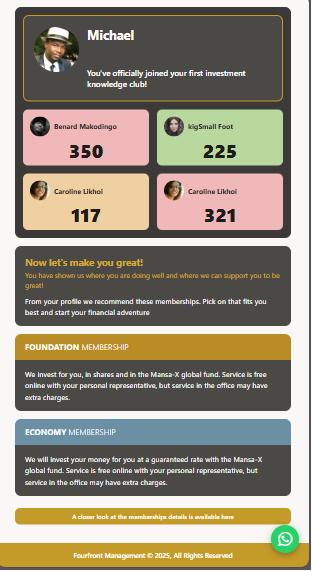

# Fourfront Management — UI Assessment

A responsive single-page UI built to match a provided design mockup for Fourfront Management.

---

## Tech Stack

- **HTML5**
- **CSS3** (custom properties, media queries)
- **Bootstrap 5.3.8** (grid, modal, utilities)
- **Bootstrap Icons 1.13.1**
- **Vanilla JavaScript**

---

## Design Outcome



---

## Project Structure

```
fourfront-ui-assesment/
├── index.html           # Main page
├── styles/
│   └── style.css        # Custom styles
├── js/
│   └── main.js          # JavaScript interactivity
├── design_outcome.png   # Screenshot of the final design
└── README.md
```

---

## Features

- **Profile card** — avatar and name in the same row, message below
- **Members stats grid** — 2×2 Bootstrap grid with coloured stat cards
- **Recommendation banner** — highlights available membership options
- **Membership accordions** — click Foundation or Economy to reveal/hide descriptions
- **Membership detail modal** — "closer look" button opens a Bootstrap modal with full details
- **WhatsApp FAB** — floating action button linking to WhatsApp
- **Responsive** — works on mobile, tablet, and desktop

---

## Requirements Met

| Requirement                                         | Status |
| --------------------------------------------------- | ------ |
| Match design layout                                 | ✅     |
| Bootstrap grid & components                         | ✅     |
| Fully responsive                                    | ✅     |
| JavaScript interactivity (modal + accordion toggle) | ✅     |
| Clean & organised code                              | ✅     |
| Membership toggle show/hide                         | ✅     |

---

## How to Run

Open `index.html` directly in a browser — no build step or server required.
